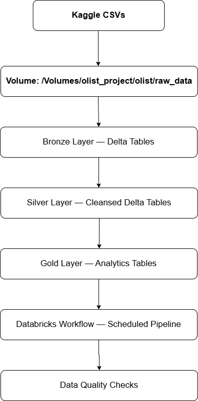

# olist-ecommerce-pipeline
End to end data engineering pipeline pn Databricks | Medallion architecture | PySpark | Delta Lake | Unity Catalog | Databricks Workflow

# Olist E-Commerce Analytics Pipeline
> End-to-end data engineering pipeline built on Databricks using 
> Medallion Architecture, Delta Lake, and PySpark.

---

## Architecture


---

## Tech Stack
| Tool | Usage |
|---|---|
| **Databricks (Free Edition)** | Compute, Notebooks, Workflows |
| **Apache Spark / PySpark** | Data transformation |
| **Delta Lake** | Storage layer with ACID transactions |
| **Unity Catalog** | Data governance and table management |
| **Spark SQL** | Aggregations and DDL |

---

## Dataset
[Brazilian E-Commerce (Olist)](https://www.kaggle.com/datasets/olistbr/brazilian-ecommerce)
- 9 CSV files, ~100k orders, 2016–2018
- Covers orders, customers, products, sellers, payments, reviews

---

## Pipeline Layers

### Bronze — Raw Ingestion
- Ingests all 9 CSVs from Unity Catalog Volume into Delta tables
- Schema-on-read with no transformations
- Preserves raw data for full auditability

### Silver — Cleansed & Typed
- Casts all columns to correct data types
- Handles nulls, deduplicates records via `dropDuplicates()`
- Normalizes timestamps, standardizes city/state casing
- Joins category translation onto products table

### Gold — Analytics
| Table | Description |
|---|---|
| `revenue_by_month` | Monthly revenue and order count |
| `revenue_by_state` | Revenue, unique customers, avg order value by state |
| `delivery_performance` | Avg delivery days, late delivery % by month |
| `product_performance` | Revenue, avg price, avg review score by product |
| `customer_segments` | One Time / Returning / High Value classification |

---

## Delta Lake Optimizations
- **OPTIMIZE** — file compaction on all Silver and Gold tables
- **Z-ORDER** — co-locate related data for faster query performance
- **VACUUM** — remove stale Delta versions beyond retention window
- **Time Travel** — version history tracked on all Delta tables

---

## Orchestration
- Databricks Workflow with 4 tasks chained sequentially
- Scheduled every Sunday midnight (IST) via Quartz cron
- Retry logic: 2 retries with 30s delay per task
- Email notifications on start, success, and failure

---

## Data Quality
- **Null checks** on all primary and foreign key columns
- **Row count checks** against minimum expected thresholds
- **Duplicate checks** on all unique key columns
- **Business logic checks** — no negative revenue, valid review scores,
  no future timestamps, valid customer segment values
- All checks passing 

---

## Project Structure
```
├── notebooks/
│   ├── 01_bronze_ingestion.ipynb
│   ├── 02_silver_transforms.ipynb
│   ├── 03_gold_aggregations.ipynb
│   ├── 04_delta_optimizations.ipynb
│   └── 05_data_quality.ipynb
├── docs/
│   └── architecture.png
└── README.md
```

---

## Author
**Akshay** — Data Engineer  
[https://www.linkedin.com/in/akshaychavan9/](#) • [https://github.com/AkshayChavan9](#)
